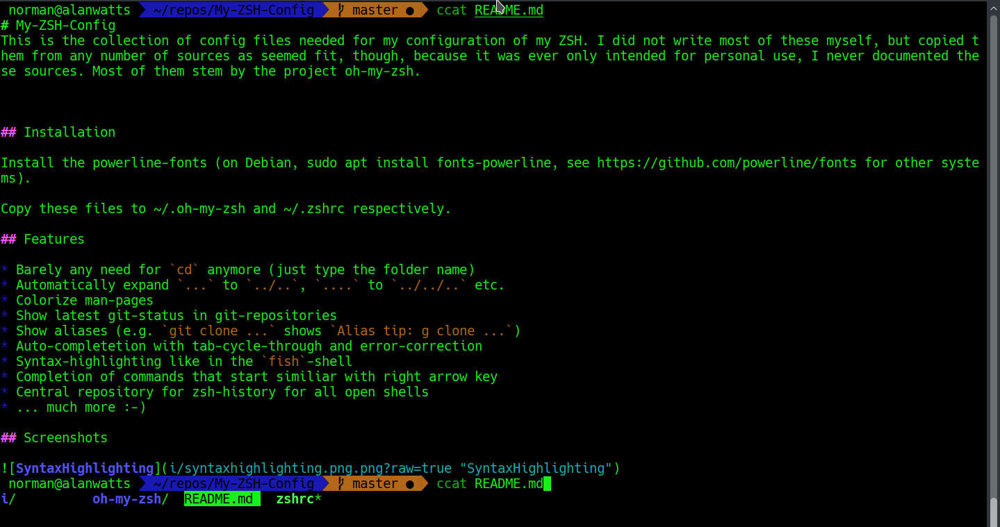
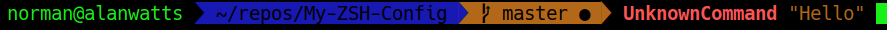
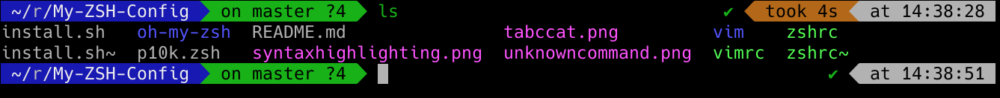
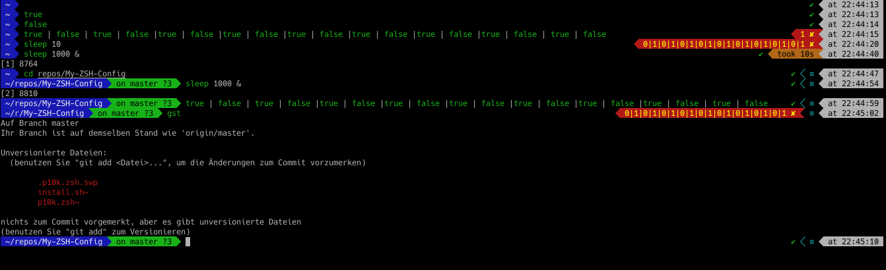

# My-ZSH-Config
This is the collection of config files needed for my configuration of my ZSH. I did not write most of these myself, but copied them from any number of sources as seemed fit, though, because it was ever only intended for personal use, I never documented these sources. Most of them stem by the project oh-my-zsh.

## Installation

Use 
```console
bash install.sh
```

## Manual Installation

Install the powerline-fonts (on Debian, sudo apt install fonts-powerline, see https://github.com/powerline/fonts for other systems).

Copy these files to ~/.oh-my-zsh and ~/.zshrc respectively.

Also, for autocompletion, run

```console
git clone https://github.com/zsh-users/zsh-autosuggestions.git $ZSH_CUSTOM/plugins/zsh-autosuggestions
```

## Features

* Barely any need for `cd` anymore (just type the folder name)
* Automatically expand `...` to `../..`, `....` to `../../..` etc.
* Colorize man-pages
* Show latest git-status in git-repositories
* Show aliases (e.g. `git clone ...` shows `Alias tip: g clone ...`)
* Auto-completetion with tab-cycle-through and error-correction
* Syntax-highlighting like in the `fish`-shell
* Completion of commands that start similiar with right arrow key
* Central repository for zsh-history for all open shells
* ... much more :-)

## Screenshots








## Defined functions

I defined some functions in here that I sometimes use. These are those functions:

```console
countdown $number_of_second		# Counts down the number of seconds given
randomtest				# Creates a folder in ~/test with a random number as name and cd's into it
download_transcription $ytid $lang	# Downloads youtube-transcriptions if youtube-dl is installed
make_pdf_smaller $pdf_file		# Tries to compress a PDF file as much as possible without the compression being visible (only if gs is installed)
treesize				# Lists directories and files (largest to smallest) in the CWD
pretty_csv $csv_file			# Creates a pretty csv listing (with aligned columns)
mytail $file				# Does `tail -fn1000000 $file`
program | myavg				# Calculates avg, median, first and last value on the output of `program`
mongodbtojson $ip $port $dbname		# Exports the MongoDb database given to a csv-file (needs mongodb to be installed)
```

Some functions are only available on machines where there is a SLURM-installation available.

```console
slurmlogpath $slurm_id			# Prints the log path of the job to STDOUT
stail $slurm_id				# Like `mytail $(slurmlogpath $slurm_id)`
staill $slurm_id			# Like `mytail $(slurmlogpath $slurm_id)`, but only 100 lines before current output (stail less)
stailn $number_of_lines	$slurm_id	# Like `tail -fn${number_of_lines} $(slurmlogpath $slurmid)`
showmyjobsstatus			# Lists the status of all currently queued SLURM-jobs for this user and why it's pending (needs `whypending` to be installed)
ftails $slurm_id			# Like `stail $slurm_id`, but, when no parameter is given, automatically uses the first squeue result of the current user
```
